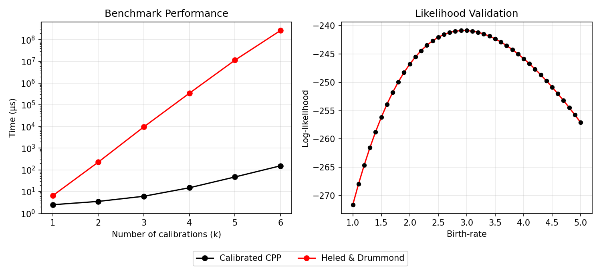

# Likelihood benchmark and validation

We benchmark the computation time for the likelihood calculation of a single fully balanced tree with 128 leaves as we increase the number of cherries for which we want to condition the age. The time is compared with the [Heled and Drummond (2015)](https://doi.org/10.1093/sysbio/syu089) implementation of the 'Calibrated Birth-Death process'.

We also validate the likelihood computation by comparing log-likelihood values for a fixed tree varying the birth-rate with both the Heled and Drummond and Calibrated CPP likelihood implementations.

## Results

**Likelihood Benchmark: CPP v Heled and Drummond**
<!-- start table -->
| Model            |   Number of Calibrations |    Time (μs) |
|------------------|--------------------------|--------------|
| Calibrated CPP   |                        1 |         2.37 |
| Calibrated CPP   |                        2 |         3.39 |
| Calibrated CPP   |                        3 |         5.88 |
| Calibrated CPP   |                        4 |        14.38 |
| Calibrated CPP   |                        5 |        46.01 |
| Calibrated CPP   |                        6 |       153.44 |
| Heled & Drummond |                        1 |         6.28 |
| Heled & Drummond |                        2 |       227.20 |
| Heled & Drummond |                        3 |      9695.07 |
| Heled & Drummond |                        4 |    345345.02 |
| Heled & Drummond |                        5 |  11332991.71 |
| Heled & Drummond |                        6 | 275041452.12 |

<!-- end table -->

**Benchmark and Validation Plot**


## Usage

Run benchmark:
 - Go to the [src/test/java/calibratedcpp/ directory](../../../src/test/java/calibratedcpp/) in the calibratedcpp-beast sub-project.
 - Run `LikelihoodBenchmark.java`.


 Run validation:
 - Go to the [src/test/java/calibratedcpp/](../../../src/test/java/calibratedcpp/) in the calibratedcpp-beast sub-project.
 - Run `CalibratedCoalescentPointProcessTest.java`.

 Generate plot:
 ```bash
python plot_output.py
 ```

## Output Files

Benchmark output:
 - [`benchmark_results.csv`](./benchmark_results.csv).

Validation output:
 - [`validation_results.csv`](./validation_results.csv).

 Plot:
 - [`combined_benchmark_validation.png`](./combined_benchmark_validation.png).
