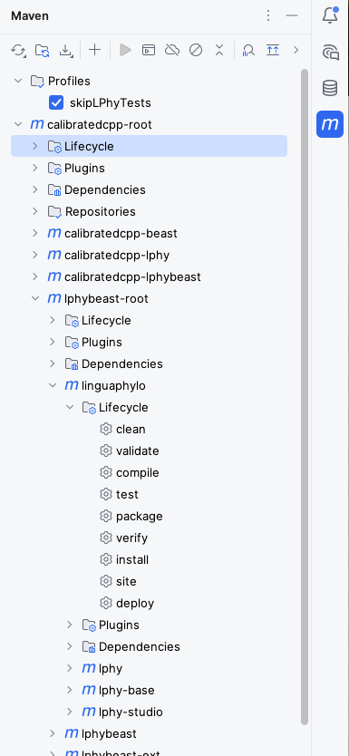
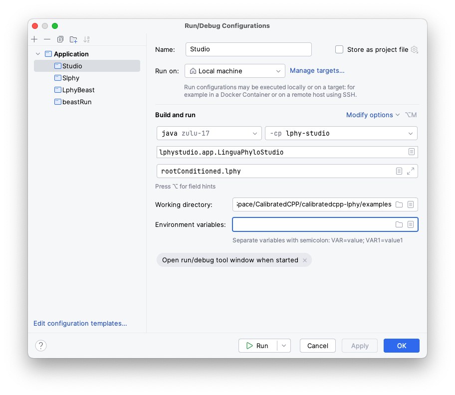
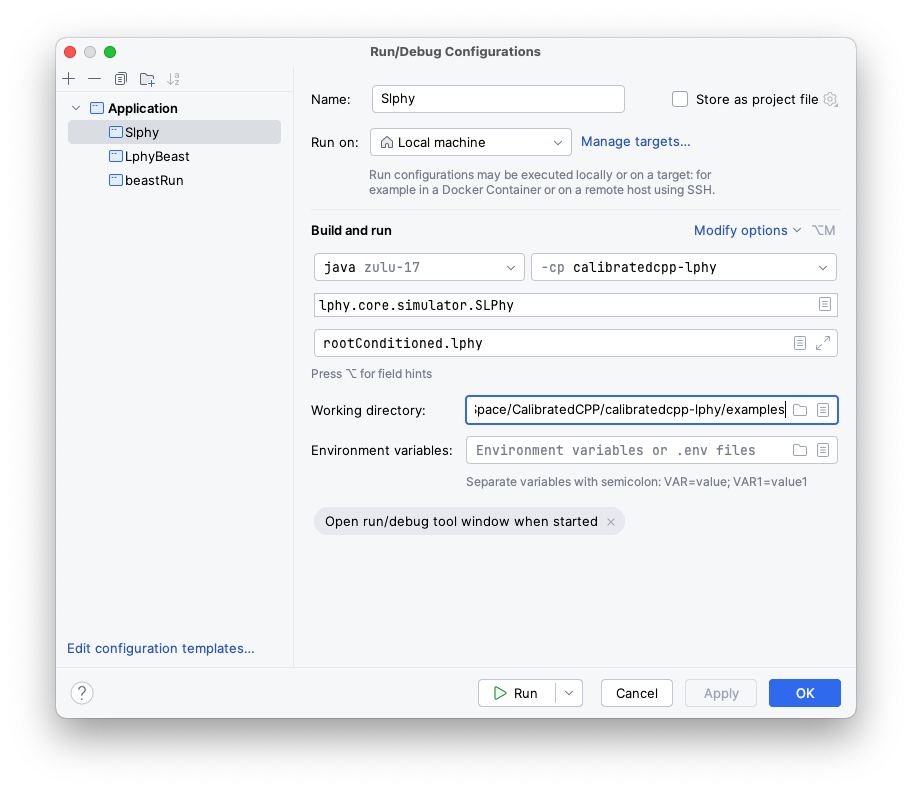
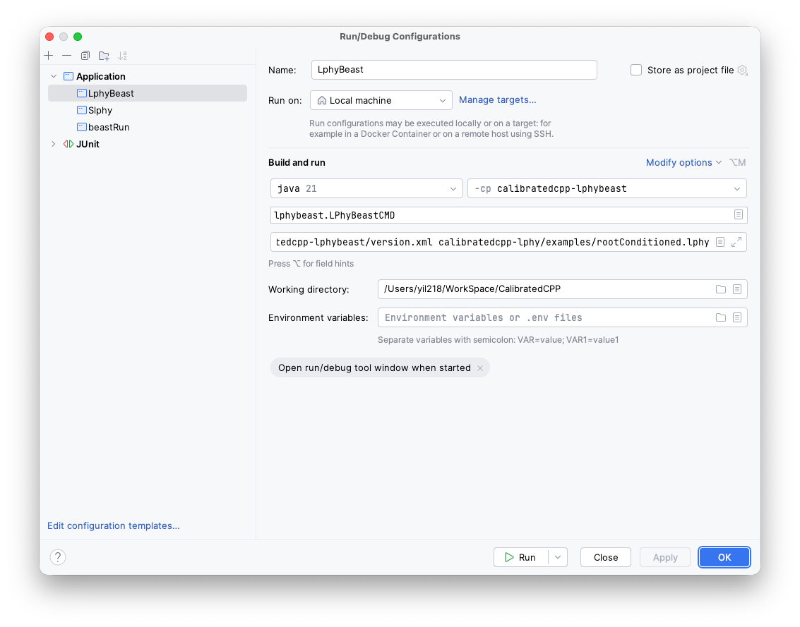
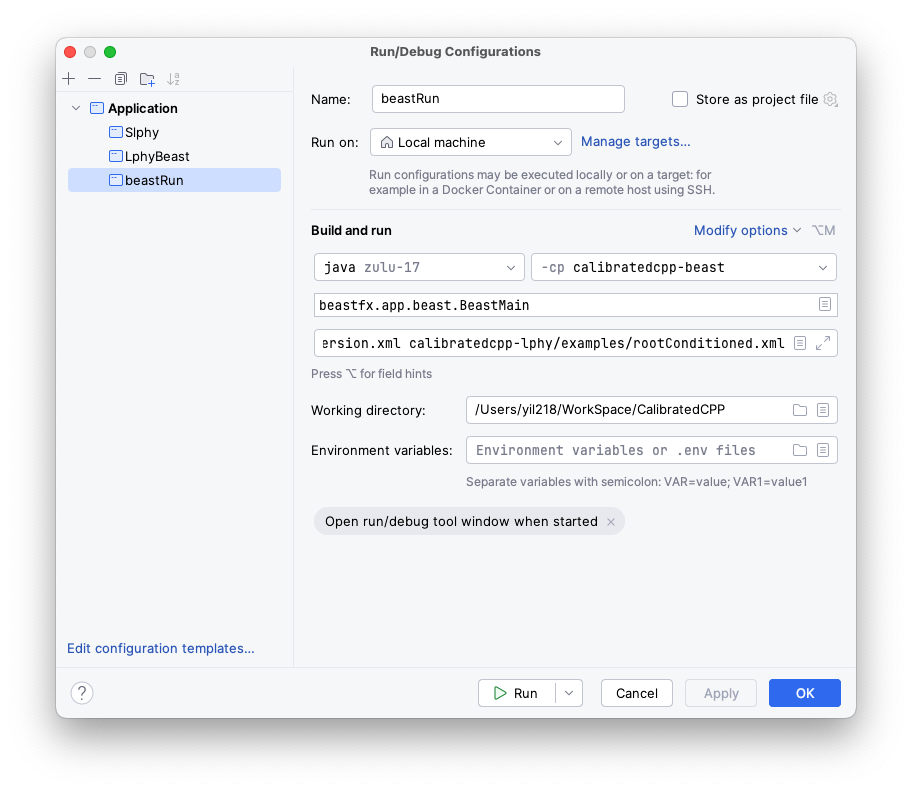
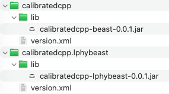

# Developer guide for CalibratedCPP GitHub Repo

## Read first

- [LPhy developer guide](https://github.com/LinguaPhylo/linguaPhylo/blob/master/DEV_NOTE.md)
- [LPhyBEAST developer guide](https://github.com/LinguaPhylo/LPhyBeast/blob/master/DEV_NOTE.md)


## For CalibratedCoalescentPointProcessing developers

### Project structure
CalibratedCPP contains 3 subproject:

1. calibratedcpp-beast
2. calibratedcpp-lphybeast
3. calibratedcpp-lphy

### Maven build

With IntelliJ. open the sidebar with maven icon:

<a href="./figures/sidebar.png">

</a>

1. Click `Reload all Maven Projects` on the top left.
2. Open the first tab `Profiles` and tick skipLphyTests.
3. Open the second tab `calibratedcpp-root/lphybeast-root/linguaphylo/`, run `clean` and then `install` in `Lifecycle`.
4. Go to `calibratedcpp-root/lphybeast-root`, run `clean` and then `install` in `Lifecycle`.
5. Go to `calibratedcpp-root`, run `clean` and then `install` in `Lifecycle`.
Then you can find all `jar` files in the `target` folder for each subproject.

### Run with configuration

The following can run as long as CalibratedCPP Beast2 package is correctly installed.

#### Lphy Studio Visualisation
<a href="./figures/studio.png">

</a>

#### Lphy Simulation
<a href="./figures/Slphy.png">

</a>

#### LphyBeast Generation
<a href="./figures/lphybeast.png">

</a>

#### BEAST2 Run
<a href="./figures/beastRun.png">

</a>

### Well-Calibrated Study
Run LPhyBEAST using the configuration described above. 
Simulated parameter values will be written to the `.log` file, while the trees, alignment, and calibrations information will be saved to separate output files. 
The simulated data are set as the starting values in the LPhyBEAST-generated XML, which can be passed directly to BEAST2 for Bayesian phylogenetic inference.
BEAST2 produce a posterior distribution that can be compared with the data generated by LPhyBEAST for well-calibrated study.

To run locally, maven build first. In local lphy studio, copy the `calibratedcpp-lphy/target/calibratedcpp-lphy-version.jar` and `calibratedcpp-lphy-studio/target/calibratedcpp-lphy-studio-version.jar` into the `lib` folder.
In local BEAST2 library (path can be found in BEASUti package manager info) create `calibratedcpp` and `calibratedcpp.lphybeast`.
For each of the folder, create a `lib` folder in it. Copy the `calibratedcpp-beast/target/calibratedcpp-beast-0.0.1.jar` into `calibratedcpp/lib` and `calibratedcpp/version.xml` into `calibratedcpp`.
Copy the `calibratedcpp-lphybeast/target/calibratedcpp-lphybeast-0.0.1.jar` into `calibratedcpp.lphybeast/lib` and `calibratedcpp-lphybeast/version.xml` into `calibratedcpp.lphybeast`.
Then local lphy studio, slphy, lphybeast, and BEAST2 can work well with `CalibratedCPP` package. 
The structure inside the BEAST2 library path should look like this:
<a href="./figures/beastLib.png">

</a>

### Code with BEAST package
Zulu 17 with package `JDK FX`should be used as the SDK of the whole project. 
Clone beast2 and beastFX repositories in your working directory:
```angular2html
git clone https://github.com/CompEvol/beast2.git
git clone https://github.com/CompEvol/BeastFX.git
```
Add both of them in `project structure - modules`, then go to `calibratedcpp-beast` click `dependencies`.
Add `beast2` and `beastFX` modules as dependencies, then click `Apply` on the bottom  right to use.

If IDE throws error saying need to specify output path, then you can go to the `project structure - module`, and go into that module which throws an error.
Go into `Path` and change the compiler output using their own module's output, and specify that with an absolute path.