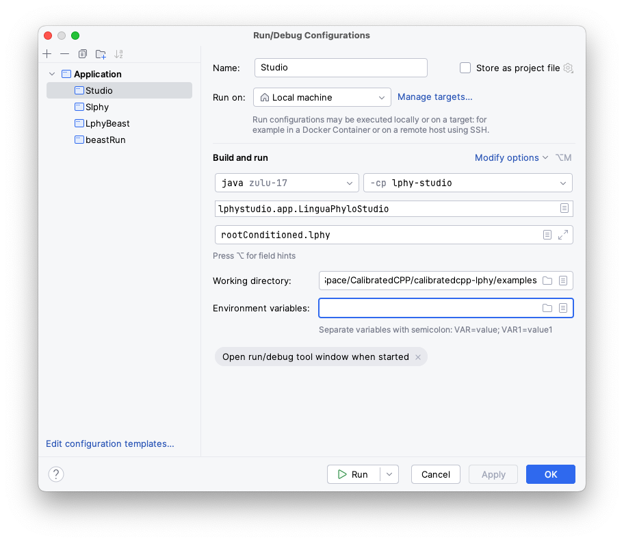
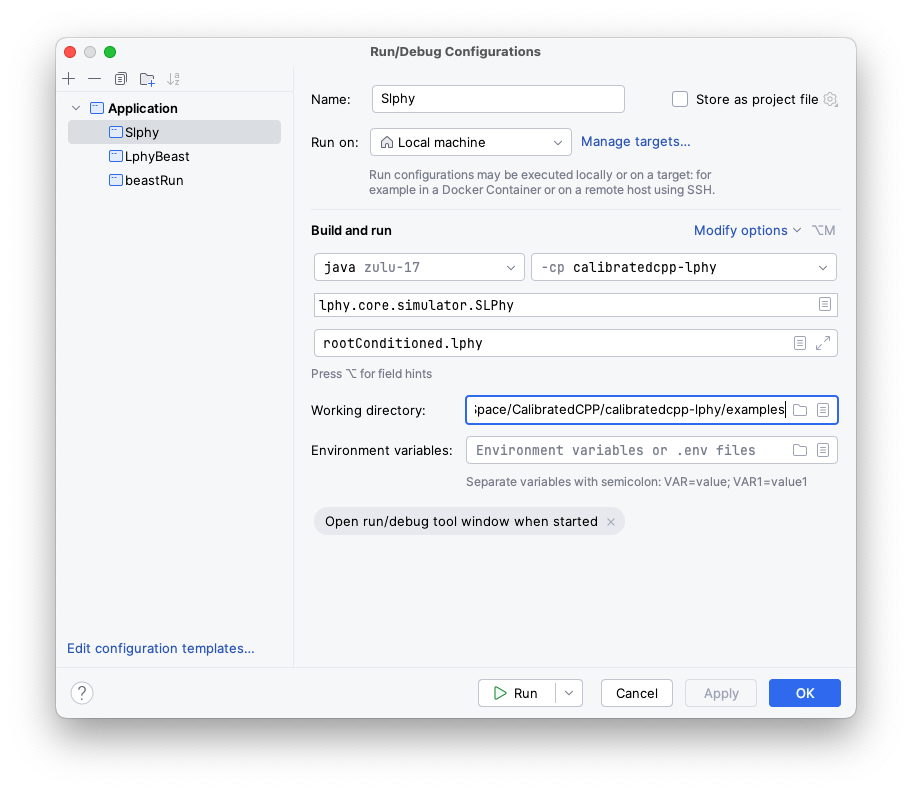

# Developer guide for CalibratedCPP GitHub Repo

## Read first

- [LPhy developer guide](https://github.com/LinguaPhylo/linguaPhylo/blob/master/DEV_NOTE.md)
- [LPhyBEAST developer guide](https://github.com/LinguaPhylo/LPhyBeast/blob/master/DEV_NOTE.md)


## For CalibratedCoalescentPointProcessing developers

### Project structure
CalibratedCPP contains 4 subprojects:

1. calibratedcpp-beast
2. calibratedcpp-lphy
3. calibratedcpp-lphy-studio
4. calibratedcpp-lphybeast

### Prerequisites

Dependencies are resolved via Maven Central. You do not need to clone BEAST 2, BeastFX, LPhy, or LPhyBEAST locally — Maven fetches them automatically.

Required:
- Java 25 (e.g. Zulu 25 with JDK FX for IDE use)
- Maven 3.9+

### Maven build
With terminal, run from the project root:
```bash
mvn install -DskipTests
```
This compiles all subprojects, runs the flatten plugin to resolve `${revision}`, and installs all JARs to your local Maven repository (`~/.m2`).

To run tests:
```bash
mvn test
```

### Run with configuration

#### Lphy Studio Visualisation
<a href="./figures/studio.png">

</a>

#### Lphy Simulation
<a href="./figures/Slphy.png">

</a>

#### LphyBeast XML Generation
Run from the project root using `CPPTree.lphy` as an example:
```bash
mvn -pl calibratedcpp-lphybeast exec:exec -Dlphybeast.args="convert ../calibratedcpp-lphy/examples/CPPTree.lphy"
```
The generated BEAST XML is saved alongside the `.lphy` file (e.g. `calibratedcpp-lphy/examples/CPPTree.xml`).

To convert and immediately run BEAST3:
```bash
mvn -pl calibratedcpp-lphybeast exec:exec -Dlphybeast.args="run ../calibratedcpp-lphy/examples/CPPTree.lphy"
```

#### BEAST3 Run
Run a BEAST XML directly from the project root:
```bash
mvn -pl calibratedcpp-beast exec:exec -Dbeast.args="-overwrite examples/b3test/b3.xml"
```

### Well-Calibrated Study
Run LPhyBEAST using the configuration described above.
Simulated parameter values will be written to the `.log` file, while the trees, alignment, and calibrations information will be saved to separate output files.
The simulated data are set as the starting values in the LPhyBEAST-generated XML, which can be passed directly to BEAST2 for Bayesian phylogenetic inference.
BEAST2 produces a posterior distribution that can be compared with the data generated by LPhyBEAST for well-calibrated study.

Run from the project root:
```bash
# Convert with 100 replicates
mvn -pl calibratedcpp-lphybeast exec:exec -Dlphybeast.args="convert -r 100 ../calibratedcpp-lphy/examples/wellCalibratedStudy.lphy"

# Run BEAST3 on each replicate
for i in {0..99}; do
    echo "Running wellCalibratedStudy_r${i}.xml"
    mvn -pl calibratedcpp-beast exec:exec -Dbeast.args="-overwrite examples/b3test/wellCalibratedStudy_r${i}.xml"
done
```

### IDE Setup

Use Java 25 (e.g. Zulu 25 with JDK FX) as the SDK for the whole project.

Dependencies (BEAST 3, BeastFX, LPhy, LPhyBEAST)  are resolved from Maven Central in the future, need to clone and build them locally for now.
After running `mvn install -DskipTests`, IntelliJ will pick up all dependencies automatically via the Maven tool window (reload all Maven projects).

If the IDE reports unresolved modules, check that the correct JDK is selected under **Project Structure → SDKs** and reload the Maven project.
